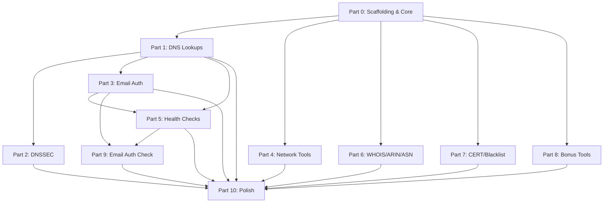

# MXToolbox Clone — Task List

> **Tech Stack:** Vite + React + TypeScript + Tailwind CSS v4 + shadcn/ui
> **Total implementable tools:** 31 (+ 4 bonus)

---

## Part 0: Project Scaffolding & Core Infrastructure

- [x] **0.1** Scaffold Vite + React + TypeScript project in `d:\Programs\code-stuff\url-scanner`
- [x] **0.2** Install & configure Tailwind CSS v4 with `@tailwindcss/vite` plugin
- [x] **0.3** Configure path aliases (`@/` → `src/`)
- [x] **0.4** Initialize shadcn/ui (`npx shadcn@latest init`) — pick dark theme, neutral palette
- [x] **0.5** Add core shadcn components: `button`, `input`, `card`, `tabs`, `badge`, `separator`, `toast`, `dialog`, `select`, `dropdown-menu`, `tooltip`, `skeleton`, `table`, `command`, `sheet`
- [x] **0.6** Create app layout structure:
  - Sidebar/nav with tool categories
  - Main content area with search input + results
  - Settings sheet/dialog for API keys & preferences
- [x] **0.7** Build the **DoH query engine** (`src/lib/doh.ts`):
  - `queryDNS(domain, type, provider)` — generic function
  - Support Google DoH and Cloudflare DoH as provider options
  - Proper error handling, timeout, response parsing
  - Map numeric DNS type codes to human-readable names
- [x] **0.8** Build **settings/config system** (`src/lib/settings.ts`):
  - `localStorage`-based persistence
  - Preferred DoH provider (Google / Cloudflare)
  - API key storage (IPinfo, Spamhaus DQS)
  - CORS proxy URL (optional)
- [x] **0.9** Build **shared results components**:
  - `<DNSResultTable>` — reusable table for DNS record results
  - `<ResultCard>` — card wrapper with status indicator (success/error/loading)
  - `<CopyButton>` — copy results to clipboard
  - `<ExportButton>` — export results as JSON/CSV
  - `<LoadingSkeleton>` — skeleton loader during queries

---

## Part 1: Core DNS Record Lookups (10 tools)

> These all use the same DoH engine with different `type` params. Build all as one batch.

- [x] **1.1** A (DNS) Lookup — `type=A`
- [x] **1.2** AAAA Lookup — `type=AAAA`
- [x] **1.3** CNAME Lookup — `type=CNAME`
- [x] **1.4** MX Lookup — `type=MX` (parse priority + exchange)
- [x] **1.5** TXT Lookup — `type=TXT`
- [x] **1.6** SOA Lookup — `type=SOA` (parse mname, rname, serial, refresh, retry, expire, minimum)
- [x] **1.7** NS Lookup — `type=NS`
- [x] **1.8** SRV Lookup — `type=SRV` (parse priority, weight, port, target)
- [x] **1.9** LOC Lookup — `type=LOC`
- [x] **1.10** Reverse Lookup — `type=PTR` (reverse IP → `x.x.x.x.in-addr.arpa` / IPv6 nibble format)

**Shared work for Part 1:**
- [x] **1.11** Create `<DNSLookupPage>` generic component that all 10 tools share
  - Input field for domain/IP
  - Record type selector (pre-filled based on tool)
  - Results table with TTL, record data, etc.
- [x] **1.12** Add routing for all 10 tools under `/dns/*`
- [x] **1.13** Test all 10 against `google.com`, `example.com`, `cloudflare.com`

---

## Part 2: DNSSEC Record Lookups (5 tools)

> Same DoH engine, specialized DNSSEC record types.

- [x] **2.1** DNSKEY Lookup — `type=DNSKEY` (parse flags, protocol, algorithm, public key)
- [x] **2.2** DS Lookup — `type=DS` (parse key tag, algorithm, digest type, digest)
- [x] **2.3** NSEC Lookup — `type=NSEC`
- [x] **2.4** NSEC3PARAM Lookup — `type=NSEC3PARAM` (parse hash algo, flags, iterations, salt)
- [x] **2.5** RRSIG Lookup — `type=RRSIG` (parse type covered, algorithm, labels, TTL, expiration, inception, key tag, signer)

**Shared work for Part 2:**
- [x] **2.6** Create DNSSEC-specific result rendering (show validation chain info)
- [x] **2.7** Add a "DNSSEC Status" badge (signed/unsigned) based on whether DNSKEY records exist
- [x] **2.8** Test against known DNSSEC-signed domains (e.g., `cloudflare.com`, `isc.org`)

---

## Part 3: Email Authentication Tools (6 tools)

> These query specific TXT subdomains and parse structured record content.

- [x] **3.1** SPF Record Lookup — query `type=TXT`, filter for `v=spf1`, parse mechanisms (`include:`, `ip4:`, `ip6:`, `a`, `mx`, `all`)
- [x] **3.2** DKIM Lookup — query `type=TXT` on `{selector}._domainkey.{domain}`, parse `v=DKIM1` fields (p=, k=, etc.). UI needs a selector input field
- [x] **3.3** DMARC Lookup — query `type=TXT` on `_dmarc.{domain}`, parse `v=DMARC1` fields (p=, rua=, ruf=, pct=, etc.)
- [x] **3.4** BIMI Lookup — query `type=TXT` on `default._bimi.{domain}`, parse `v=BIMI1`, extract logo URL
- [x] **3.5** MTA-STS Lookup — query `type=TXT` on `_mta-sts.{domain}`, parse `v=STSv1` fields
- [x] **3.6** TLSRPT Lookup — query `type=TXT` on `_smtp._tls.{domain}`, parse `v=TLSRPTv1` fields

**Shared work for Part 3:**
- [x] **3.7** Build generic `<EmailAuthPage>` component handling parsing logic for these complex TXT strings
- [x] **3.8** Test against domains with known email auth (e.g., `google.com`, `microsoft.com`, `protonmail.com`)

---

## Part 4: Network & Connectivity Tools (4 tools)

- [x] **4.1** What Is My IP? — call `https://api.ipify.org?format=json` (IPv4) and `https://api64.ipify.org?format=json` (IPv6)
  - Display both IPv4 and IPv6
  - Show geolocation info if IPinfo key is configured
- [x] **4.2** HTTP Lookup — `fetch()` target URL
  - Report: status code, headers (Content-Type, Server, X-Powered-By, etc.), redirect chain, timing
  - Handle CORS errors gracefully with clear messaging
- [x] **4.3** HTTPS Lookup — same as HTTP but enforce `https://` prefix
  - Note: cannot inspect SSL certificate from browser (display disclaimer)
- [x] **4.4** IPSECKEY Lookup — `type=IPSECKEY` via DoH

**Shared work for Part 4:**
- [x] **4.5** Build `<HTTPResultCard>` showing response headers in a key-value table
- [x] **4.6** Test HTTP/HTTPS lookups against CORS-friendly sites and verify graceful CORS error handling

---

## Part 5: DNS Health & Domain Health (2 composite tools)

> These aggregate multiple lookups into a single health report.

- [x] **5.1** DNS Check — run all of: A, AAAA, MX, NS, SOA, TXT, CNAME lookups in parallel
  - Present consolidated health card
  - Flag missing/unexpected records
  - Show nameserver consistency info
- [x] **5.2** Domain Health — run all of: DNS Check + SPF + DKIM + DMARC + BIMI + MTA-STS + TLSRPT
  - Aggregate into a scored report card (A/B/C/D/F or percentage)
  - Category breakdown: DNS, Email Auth, Security
  - Color-coded status for each check

**Shared work for Part 5:**
- [x] **5.3** Build `<HealthReportCard>` component with expandable sections
- [x] **5.4** Build scoring algorithm (weight each check, compute overall grade)
- [x] **5.5** Test against well-configured domains vs. poorly-configured ones

---

## Part 6: External API Tools — WHOIS & Registration (3 tools)

> These use RDAP/external APIs instead of DoH.

- [ ] **6.1** Whois Lookup — query `https://rdap.org/domain/{domain}`
  - Parse: registrar, creation/expiry dates, nameservers, status codes, registrant info
  - Display in structured cards
  - Handle CORS errors with fallback message
- [ ] **6.2** ARIN Lookup — query `https://rdap.arin.net/registry/ip/{ip}`
  - Parse: network name, CIDR, organization, registration dates
  - Display in structured card
- [ ] **6.3** ASN Lookup — query `https://api.ipapi.is?q={ip}` (free, 1000/day) OR IPinfo (if user has token)
  - Parse: ASN number, organization, country, registry
  - Display route/prefix info

**Shared work for Part 6:**
- [ ] **6.4** Build `<RegistrationCard>` component for RDAP/WHOIS results
- [ ] **6.5** Handle rate limits gracefully (show remaining quota if available)
- [ ] **6.6** Test against various IPs and domains

---

## Part 7: Certificate & Blacklist Tools (2 tools)

> These require special handling (CORS proxy / API keys).

- [x] **7.1** CERT Lookup — query `https://crt.sh/?q={domain}&output=json` via CORS proxy
  - Parse: issuer, subject, validity dates, serial number, certificate chain
  - Display in a timeline/table sorted by issuance date
  - Fallback: offer "Open in crt.sh" link if CORS proxy not configured
- [x] **7.2** Blacklist Check — multi-strategy approach:
  - Strategy A: Query non-Spamhaus DNSBLs via DoH (e.g., `bl.spamcop.net`, `b.barracudacentral.org`, `dnsbl.sorbs.net`, etc.)
  - Strategy B: If user has Spamhaus DQS key, query via their key
  - Display: per-list status (listed / clean / error), overall summary
  - Show ~20-30 common DNSBL lists

**Shared work for Part 7:**
- [x] **7.3** Build `<BlacklistResultGrid>` showing check/cross icons per DNSBL
- [x] **7.4** Build CORS proxy configuration UI in settings
- [x] **7.5** Test CERT lookup with and without CORS proxy
- [x] **7.6** Test blacklist check against known-clean and known-listed IPs

---

## Part 8: Bonus Tools (4 tools)

> Pure client-side, no API calls needed.

- [x] **8.1** Email Header Analyzer
  - Textarea input for raw email headers
  - Parse: Received chain (trace route), From, To, Subject, SPF/DKIM/DMARC results, Message-ID, timestamps
  - Display as a visual hop-by-hop trace with timing between hops
- [x] **8.2** Subnet Calculator
  - Input: IP + CIDR or netmask
  - Output: network address, broadcast address, first/last host, total hosts, wildcard mask, binary representation
- [x] **8.3** SPF Generator
  - Wizard UI: add mechanisms (include, ip4, ip6, a, mx), choose qualifier (-all, ~all, ?all)
  - Generate and display the final SPF TXT record, with copy button
- [x] **8.4** DMARC Generator
  - Wizard UI: choose policy (none/quarantine/reject), add rua/ruf, set pct, subdomain policy
  - Generate and display the final DMARC TXT record, with copy button

**Shared work for Part 8:**
- [x] **8.5** Test email header parser against sample headers from Gmail, Outlook, etc.
- [x] **8.6** Test subnet calculator against known subnets

---

## Part 9: Email Authentication Check (partial Email Deliverability)

> The DNS-verifiable portion of Email Deliverability, without SMTP testing.

- [x] **9.1** Build "Email Auth Check" composite tool:
  - Run SPF + DKIM + DMARC + BIMI + MTA-STS + TLSRPT + MX checks in parallel
  - Aggregate into a deliverability score/grade
  - Flag specific issues: missing SPF, DMARC set to `p=none`, no DKIM, no BIMI, etc.
  - Provide actionable recommendations for each issue
- [x] **9.2** Build `<DeliverabilityReport>` component with:
  - Overall grade card (A+ through F)
  - Section-by-section breakdown with expand/collapse
  - "What to fix" recommendations panel
- [x] **9.3** Add disclaimer: "This checks DNS-based email authentication only. SMTP connectivity testing requires a server-side tool."
- [x] **9.4** Test against 5+ domains with varying levels of email auth configuration

---

## Part 10: Polish & Final Integration

- [x] **10.1** Build the **SuperTool** — a unified search bar that auto-detects input type:
  - Domain → DNS Check
  - IP address → Reverse Lookup + ARIN/ASN
  - Email header (multi-line) → Header Analyzer
  - URL → HTTP/HTTPS Lookup
- [x] **10.2** Add **search history** (localStorage) with recent queries
- [x] **10.3** Add **dark/light mode toggle** (shadcn built-in theming)
- [x] **10.4** Add **keyboard shortcuts** (Cmd/Ctrl+K for tool search, Enter to run query)
- [x] **10.5** Add **responsive design** — mobile-friendly sidebar collapse
- [x] **10.6** Add **export all results** — JSON download of full query results
- [x] **10.7** Add **tab-based navigation** — open multiple tools side by side or in tabs
- [x] **10.8** Final UI polish: loading states, error states, empty states, micro-animations
- [x] **10.9** Cross-browser testing (Chrome, Firefox, Edge)
- [x] **10.10** Performance review — ensure parallel queries don't overwhelm the DoH API

---

## Execution Order

> **Recommended build order:** P0 → P1 → P3 → P2 → P4 → P5 → P6 → P7 → P8 → P9 → P10
